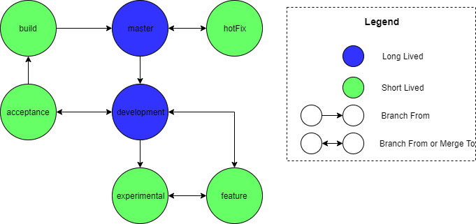

We intend to use a branching strategy very closely based on [GitFlow](https://nvie.com/posts/a-successful-git-branching-model/).

# Branching Guidelines

The repository has the following types of branches:
- master
- development
- feature
- experimental
- acceptance
- hotFix
- build

This is what each branch is used for

- The _master_ branch contains all deliverable builds. There is only one _master_ branch.
- The _development_ branch serves as the trunk of the development tree. There is only one _development_ branch.
- A _feature_ branch is where new development takes place.
- An _experimental_ branch is where experimentation can take place and be recorded with no risk to the repository.
- An _acceptance_ branch is where final testing is done on potential releases
- A _hotFix_ branch is where bug fixes to delivered builds take place.
- A _build_ branch is where accepted code is prepared for the _master_ branch

What follows is a graph which will help to describe the flow of the branching strategy:

